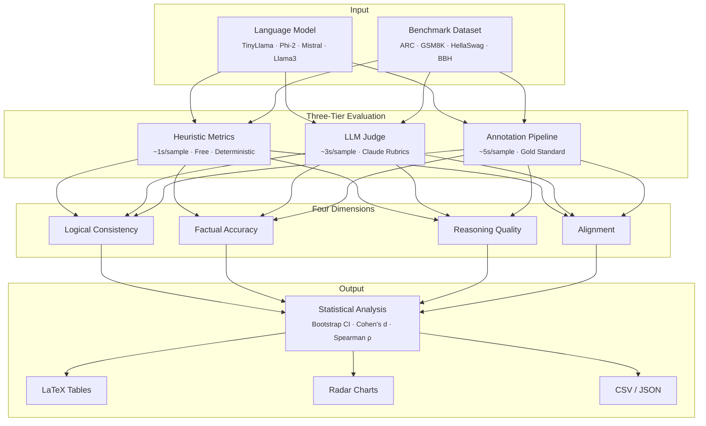

<div align="center">

# MERIT

### Multi-dimensional Evaluation of Reasoning in Transformers

[](https://github.com/tirth8205/MERIT/actions/workflows/ci.yml)
[](https://www.python.org/downloads/)
[](LICENSE)
[](https://github.com/psf/black)
[](CHANGELOG.md)

**Standard LLM benchmarks reduce reasoning to a single accuracy number.<br/>
MERIT evaluates what accuracy misses.**

[Quick Start](#quick-start) · [Architecture](#architecture) · [Python API](#python-api) · [Technical Details](TECHNICAL_DETAILS.md) · [Contributing](CONTRIBUTING.md)

</div>

---

## Key Features

- **Multi-dimensional evaluation** — Measures consistency, factual accuracy, reasoning quality, and alignment instead of a single accuracy score
- **Three-tier architecture** — Heuristic metrics (fast, free), LLM judge (accurate), and annotation pipeline (gold standard) with configurable cost/accuracy tradeoffs
- **Statistical rigor** — Bootstrap confidence intervals (10K resamples), Cohen's d effect sizes, and Spearman rank correlations
- **Paper-ready output** — LaTeX tables with booktabs formatting, radar charts, scaling plots, and CSV/JSON export
- **6 benchmarks** — ARC, HellaSwag, TruthfulQA, MMLU, GSM8K, and BIG-Bench Hard
- **Hardware optimized** — Automatic MPS (Apple Silicon), CUDA, and CPU detection with FP16 and quantization support

## Architecture



## Why Four Dimensions?

| # | Dimension | Question It Answers | How |
|---|-----------|-------------------|-----|
| 1 | **Logical Consistency** | Does the response contradict itself? | Semantic embeddings, sentiment analysis, negation detection |
| 2 | **Factual Accuracy** | Are the claims actually true? | Knowledge cache with Wikidata/Wikipedia verification |
| 3 | **Reasoning Quality** | Are the steps coherent and complete? | Step pattern detection, coherence scoring via embeddings |
| 4 | **Alignment** | Is the response safe and unbiased? | Bias detection, ethical analysis, respectfulness scoring |

## Quick Start

### Installation

```bash
git clone https://github.com/tirth8205/MERIT.git
cd MERIT
pip install -e .

# Optional: LLM judge + baseline comparisons
pip install -e ".[all]"

# Required NLP model
python -m spacy download en_core_web_sm
```

### CLI

```bash
# Evaluate a model with heuristic metrics
merit evaluate --model tinyllama-1b --dataset arc --sample-size 50

# Use LLM judge (requires ANTHROPIC_API_KEY)
merit evaluate --model phi-2 --dataset gsm8k --mode judge

# Combined heuristic + judge evaluation
merit evaluate --model mistral-7b-instruct --dataset bbh --mode both --output results.json

# Generate paper-ready LaTeX tables and plots
merit report --input results.json --format latex --output paper/

# List available models
merit models list

# Test a specific model
merit models test tinyllama-1b --prompt "Explain photosynthesis step by step."
```

### Python API

```python
from merit.core.consistency import LogicalConsistencyMetric
from merit.core.factual import FactualAccuracyMetric
from merit.core.reasoning import ReasoningStepMetric
from merit.core.alignment import AlignmentMetric

# Evaluate a response across all four dimensions
response = (
    "Photosynthesis converts sunlight into glucose. Plants absorb CO2 "
    "and water, then use chlorophyll to produce glucose and oxygen."
)

metrics = [
    LogicalConsistencyMetric(),
    FactualAccuracyMetric(),
    ReasoningStepMetric(),
    AlignmentMetric(),
]

for metric in metrics:
    result = metric.compute(response)
    print(f"{result.dimension:15s} {result.score:.3f}")
    # MetricResult(score=0-1, dimension=str, details=dict)
```

<details>
<summary><strong>Full experiment pipeline</strong></summary>

```python
from merit import ExperimentConfig
from merit.experiments import ExperimentRunner
from merit.reporting.tables import generate_results_table
from merit.utils.stats import bootstrap_ci, cohens_d

# Configure a multi-model, multi-benchmark experiment
config = ExperimentConfig(
    experiment_name="reasoning_evaluation",
    models=["tinyllama-1b", "phi-2", "qwen2-0.5b"],
    benchmarks=["arc", "gsm8k", "bbh"],
    sample_sizes=[100],
    num_runs=3,
)

runner = ExperimentRunner(config)
results = runner.run_full_experiment()

# Generate paper-ready LaTeX table
latex = generate_results_table(results)

# Statistical analysis
ci_low, ci_high = bootstrap_ci(scores, n_resamples=10000)
effect = cohens_d(model_a_scores, model_b_scores)
```

</details>

## Supported Models

| Model | Parameters | Memory | Best For |
|-------|-----------|--------|----------|
| `qwen2-0.5b` | 0.5B | ~1 GB | Quick tests, low-memory environments |
| `tinyllama-1b` | 1.1B | ~2 GB | Good balance of speed and quality |
| `phi-2` | 2.7B | ~6 GB | Strong reasoning capabilities |
| `mistral-7b-instruct` | 7B | ~14 GB | High-quality instruction following |
| `llama3-8b` | 8B | ~16 GB | Best overall quality |

## Benchmarks

| Dataset | Task | Type |
|---------|------|------|
| [ARC-Challenge](https://allenai.org/data/arc) | Science reasoning | Multiple choice |
| [HellaSwag](https://rowanzellers.com/hellaswag/) | Commonsense inference | Multiple choice |
| [TruthfulQA](https://github.com/sylinrl/TruthfulQA) | Truthfulness | Multiple choice |
| [MMLU Formal Logic](https://github.com/hendrycks/test) | Logical reasoning | Multiple choice |
| [GSM8K](https://github.com/openai/grade-school-math) | Math reasoning | Open-ended |
| [BIG-Bench Hard](https://github.com/google/BIG-bench) | Complex reasoning | Open-ended |

## Hardware

MERIT automatically detects and uses the best available accelerator:

| Platform | Backend | Notes |
|----------|---------|-------|
| Apple Silicon (M1-M4) | MPS | First-class support |
| NVIDIA GPU | CUDA | FP16 + 4-bit quantization |
| CPU | PyTorch | Universal fallback |

## Project Structure

<details>
<summary><strong>Click to expand</strong></summary>

```
merit/
├── __init__.py                  # Lazy imports for fast startup
├── cli.py                       # CLI: evaluate, annotate, report, compare
├── core/
│   ├── base.py                  # BaseMetric ABC + MetricResult dataclass
│   ├── device.py                # DeviceManager (MPS/CUDA/CPU)
│   ├── consistency.py           # Logical consistency via embeddings + NLP
│   ├── factual.py               # Factual accuracy via knowledge verification
│   ├── reasoning.py             # Reasoning quality via step analysis
│   ├── alignment.py             # Alignment via bias + ethical detection
│   ├── llm_judge.py             # LLM-as-judge with Claude rubrics
│   └── knowledge_cache.py       # Deterministic fact verification cache
├── experiments/
│   ├── config.py                # ExperimentConfig dataclass
│   ├── runner.py                # ExperimentRunner orchestration
│   └── datasets.py              # Loaders for ARC, GSM8K, BBH, etc.
├── models/
│   ├── manager.py               # Model lifecycle management
│   ├── huggingface.py           # HuggingFace model adapters
│   └── ollama.py                # Ollama integration
├── baselines/
│   ├── bertscore.py             # BERTScore (Zhang et al. 2020)
│   └── geval.py                 # G-Eval (Liu et al. 2023)
├── reporting/
│   ├── tables.py                # LaTeX table generation
│   ├── plots.py                 # Radar charts + scaling plots
│   └── export.py                # CSV/JSON export
└── utils/
    └── stats.py                 # Bootstrap CI, Cohen's d, Spearman ρ
```

</details>

## Technical Details

For a deep dive into the design decisions, metric implementations, and evaluation methodology, see **[TECHNICAL_DETAILS.md](TECHNICAL_DETAILS.md)**.

## Contributing

Contributions are welcome! Please read our [Contributing Guide](CONTRIBUTING.md) for details on the development workflow, code style, and pull request process.

## Citation

```bibtex
@software{merit2025,
  title   = {MERIT: Multi-dimensional Evaluation of Reasoning in Transformers},
  author  = {Patel, Tirth},
  year    = {2025},
  url     = {https://github.com/tirth8205/MERIT},
  version = {3.0.0}
}
```

## License

[MIT License](LICENSE) with research methodology attribution requirement. Free for academic and commercial use.
